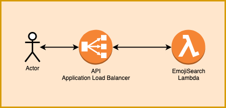

# [T3chFlicks](https://t3chflicks.org): Emoji Search
> An NLP application for searching Emojis.


> # [🤖 The Service Landing Page Can Be Found Here 🤖](https://emoji-search.t3chflicks.org)

## Architecture


## Read The Blog Post

[](./blog_post.md)

[](https://t3chflicks.medium.com/giving-away-free-apis-without-going-broke-cd87a7dc78a5)


## Try The Service
You can access this service on the [T3chFlicks site](https://t3chflicks.org/Services/emoji-search).

Or, you can run the service locally using the [emoji search notebook](./src/EmojiSearch.ipynb).

## Deployment
This project uses GoogleNews vectors slim version. They can be downloaded from [here](https://github.com/eyaler/word2vec-slim).

Then deploy the pipeline to AWS:
```
aws cloudformation deploy --template-file ./aws/00-pipeline.yml  --parameter-overrides CredentialsArn=arn:aws:codestar-connections:eu-west-1:482883100039:connection/****** BranchName=master ProjectName=emoji-search --stack-name emoji-search-pipeline-master --region=eu-west-1  --capabilities CAPABILITY_NAMED_IAM --profile=Prod_T3
  ```

We do not want to store the GoogleNews Vectors in the repository as they are 1.5GB large. The deployment pipeline will therefore fail in the first deploy as it will search for the model in the empty s3 bucket provisioned. 

We must therefore upload the model to the bucket:

```
aws s3 cp  src/fixtures/GoogleNews-vectors-negative300-SLIM.bin.gz s3://<your_s3_bucket_name>/models/GoogleNews-vectors-negative300-SLIM.bin.gz
```

Then we must trigger the deploy to occur again.

## Contribution
Please contribute to this project by improving the script, or by reporting issues with the performance.

---

This project was created by [T3chFlicks](https://t3chflicks.org) - A tech focused education and services company.

---